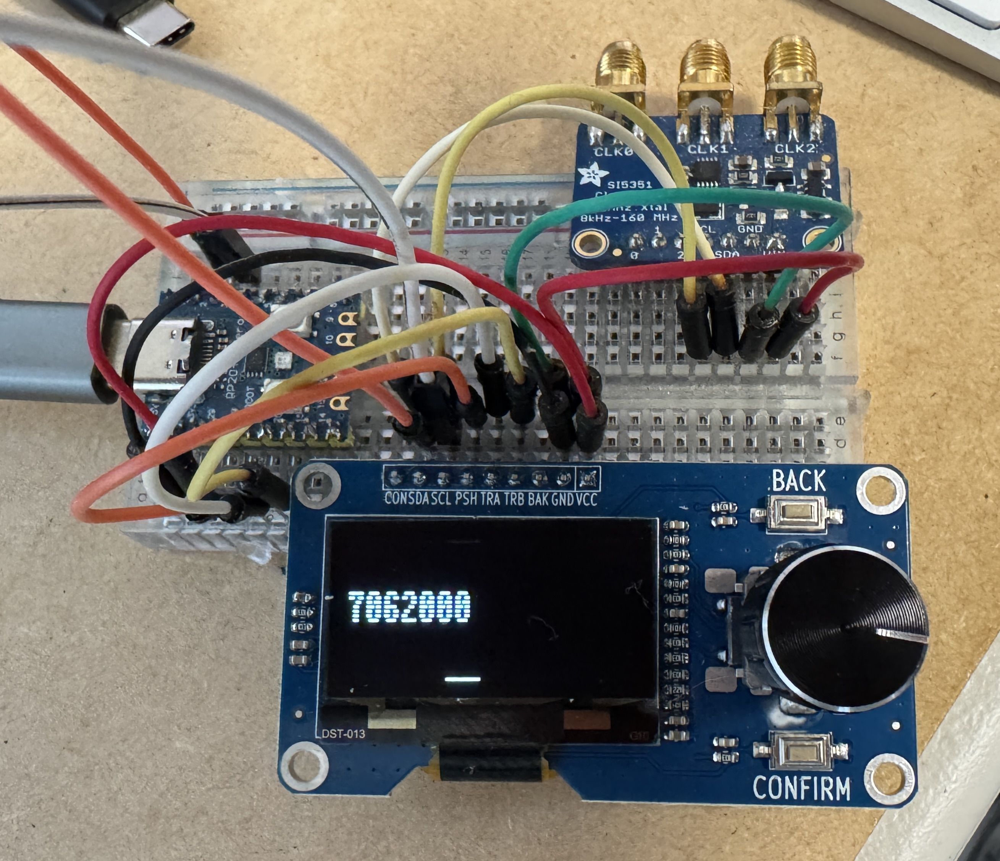

# micropython_vfo
Simple VFO in Micropython using Si5351 ssd1306 and rotary encoder

This is a single frequency VFO meant for a direct conversion receiver or double sideband transmitter.

The CPU board is a low cost RP2040 Zero board.
An Si5351 clock generator is used.
An ssd1306 128x32 OLED display is used.
A Rotary encoder changes frequency and pushing the button changes step.

I've started using another board with an integrated sh1106 OLED display and rotary encoder.

Code is in monoboard_vfo.py

## Dependencies

- ssd1306.py from https://github.com/kwankiu/ssd1306wrap/
- sh1106.py from https://github.com/robert-hh/SH1106
- si5351.py from https://github.com/hwstar/Si5351_Micropython

## Wiring

You can deduce the wiring from the vfo.py file (or change it as required).
